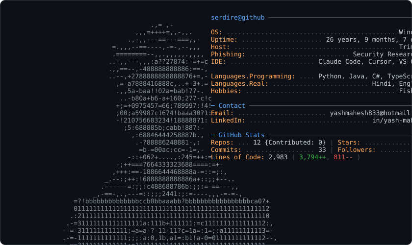

<div align="center">


</div>

## ⚡ > SYSTEM.BOOT_

```
$ whoami
> isac.martins :: フルスタック開発者
> Experience: [ 10+ YEARS ]
> Specialized in [ AI_AGENTS | MCP_PROTOCOL | FULLSTACK_DEV ]
> Status: [ ONLINE ] - Building the future with intelligent systems
```

## 🐍 > CONTRIBUTION.MATRIX_

<div align="center">


</div>


### 🧬 > ABOUT.USER_

```python
class IsacMartins:
    def __init__(self):
        self.name = "Isac Martins"
        self.role = "Fullstack Developer"
        self.specialization = ["AI Agents", "MCP", "Intelligent Systems"]
        self.location = "Tocantins/MG, Brazil"

    def get_current_focus(self):
        return {
            "🤖": "Building AI Agents with MCP",
            "🔌": "Creating MCP Servers",
            "📱": "Mobile Development",
            "🌐": "Web Applications",
            "⚙️": "Backend Systems",
            "🗄️": "Database Architecture"
        }

    def say_hi(self):
        print("Control the Matrix 🚀")
```


## 📊 > USER.STATS_

[](https://git.io/streak-stats)
  

## 🔮 > TECH.STACK_

<div align="center">

### 🤖 ｢ AI & AGENTS ｣


### 📱 ｢ MOBILE ｣


### 🌐 ｢ WEB ｣


### ⚙️ ｢ BACKEND ｣


### 🗄️ ｢ DATABASE ｣


</div>

## 🏆 > ACHIEVEMENTS.UNLOCK_

<div align="center">
  
</div>

## 🤖 > MCP.SERVERS_

```javascript
// Model Context Protocol Servers
const mcpServers = {
    status: "🟢 ACTIVE",
    servers: [
        {
            name: "🔌 Custom MCP Server",
            description: "Building intelligent integrations",
            tools: ["data_processing", "api_integration", "automation"],
            status: "in_development"
        }
    ],
    vision: "Connecting AI to everything 🌐"
}
```

## 🎯 > CURRENT.FOCUS_

```yaml
🔭 Working on:
  - 🤖 Developing AI Agents with advanced capabilities
  - 🔌 Creating custom MCP servers for LLM integration
  - 📱 Building cross-platform mobile applications
  - 🌐 Architecting scalable web solutions

🌱 Learning:
  - Advanced AI agent architectures
  - Model Context Protocol deep dive
  - Distributed systems design
  - Cloud-native development

💡 Open to:
  - AI/ML projects
  - MCP server development
  - Fullstack opportunities
  - Open source collaboration
```

## 🌐 > CONTROL.MATRIX_

<div align="center">

[](https://www.linkedin.com/in/isacmartins)
[](mailto:isacmartins@i2tech.dev)
[](https://discordapp.com/users/Isac%20Martins#4516)
[](https://api.whatsapp.com/send?phone=5532999644257&text=Ol%C3%A1,%20vim%20pelo%20github)
[](https://t.me/IsacMartins012)

</div>

---

<div align="center">

```
╔═══════════════════════════════════════════════════════════════╗
║  "The Matrix is everywhere. It's all around us."             ║
║  - Building the future, one commit at a time 🚀              ║
╚═══════════════════════════════════════════════════════════════╝
```

**💚 "Wake up, Neo. The AI revolution has you..."**

</div>

---


## GitHub Stats

<picture>
  <source media="(prefers-color-scheme: dark)" srcset="dark_mode.svg">
  <source media="(prefers-color-scheme: light)" srcset="light_mode.svg">
  
</picture>


